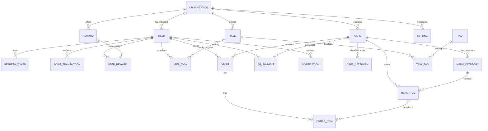

# GölBox Veritabanı Tasarım Dokümanı (Database Design Bible)

Bu doküman, GölBox projesinin MSSQL veritabanı şemasını, tablolarını, ilişkilerini, veri tiplerini, indeks stratejilerini ve veri tabanı düzeyindeki kurallarını (constraints) detaylandırmaktadır. 

Proje, **multi-tenant (çok kiracılı)** yapıda olup, her organizasyon (belediye) kendi veri kümesini izole şekilde yönetir. Bu izolasyon tablolardaki `OrganizationId` kolonu ve EF Core Query Filter mekanizması ile sağlanacaktır.

---

## 1. Genel Tasarım İlkeleri

1. **Birincil Anahtarlar (Primary Keys):** Tüm tablolarda birincil anahtar olarak **GUID (uniqueidentifier)** kullanılacaktır. EF Core tarafında `Guid.NewGuid()` ile kod seviyesinde üretilecektir.
2. **Yumuşak Silme (Soft Delete):** Fiziksel olarak veritabanından veri silinmeyecektir. Tüm veri tabloları `IsDeleted`, `DeletedDate` ve `DeletedBy` alanlarını içerecektir.
3. **Denetim Kolonları (Audit Columns):** Her tabloda standardı sağlamak amacıyla bir `BaseEntity` kullanılacaktır.
4. **Tarih-Saat Standardı:** Tüm tarih alanları **UTC** (`datetime2`) formatında saklanacaktır.
5. **İndeks Stratejisi:** 
   - Tüm yabancı anahtar (FK) kolonlarında indeks bulunacaktır.
   - Sıkça sorgulanan ve filtrelenen `IsDeleted = 0` durumları için **Filtered Index** yapısı kullanılacaktır.
   - Multi-tenant sorguları hızlandırmak için `OrganizationId` ve `IsDeleted` kolonlarını içeren kompozit indeksler kurulacaktır.

### Standart BaseEntity Alanları

Tüm veri tabloları (ilişki tabloları hariç) aşağıdaki kolonları miras alacaktır:

| Kolon Adı | MSSQL Veri Tipi | Boş Olabilir mi? | Açıklama |
| :--- | :--- | :--- | :--- |
| **Id** | `uniqueidentifier` | Hayır | Primary Key (PK) |
| **CreatedDate** | `datetime2` | Hayır | Kayıt oluşturulma zamanı (UTC) |
| **CreatedBy** | `uniqueidentifier` | Evet | Kaydı oluşturan kullanıcı ID |
| **UpdatedDate** | `datetime2` | Evet | Son güncelleme zamanı (UTC) |
| **UpdatedBy** | `uniqueidentifier` | Evet | Son güncelleyen kullanıcı ID |
| **DeletedDate** | `datetime2` | Evet | Silinme zamanı (UTC) |
| **DeletedBy** | `uniqueidentifier` | Evet | Silen kullanıcı ID |
| **IsDeleted** | `bit` | Hayır | Yumuşak silme bayrağı (Varsayılan: 0) |

---

## 2. Varlık İlişki (ER) Diyagramı

Aşağıdaki Mermaid diyagramı, GölBox veritabanının modüller arası ilişkilerini ve temel tablolardaki kardinaliteleri göstermektedir:



---

## 3. Tablo Şemaları ve Detayları

### 3.1. Organizasyon ve Yetkilendirme (Tenant & Auth)

#### `Organizations` (Tenant Tablosu)
Sistemdeki belediyeleri veya kurumları temsil eder.

| Kolon Adı | Veri Tipi | Kısıtlar (Constraints) | Açıklama |
| :--- | :--- | :--- | :--- |
| **Id** | `uniqueidentifier` | PK | Organizasyon ID |
| **Name** | `nvarchar(256)` | Unique, Not Null | Belediyenin/Kurumun adı |
| **ThemeColor** | `nvarchar(50)` | Not Null | Kurumsal birincil renk kodu (HEX) |
| **LogoUrl** | `nvarchar(1000)` | Null | Kurumun logo adresi |
| **TimeZone** | `nvarchar(100)` | Not Null | Raporlama ve yerel saat dönüşümleri için zaman dilimi (örn: 'Europe/Istanbul') |

#### `Users` (AspNetUsers Uzantısı)
Kullanıcıların temel ve profil bilgilerini tutar. ASP.NET Identity yapısına uygun tasarlanmıştır.

| Kolon Adı | Veri Tipi | Kısıtlar | Açıklama |
| :--- | :--- | :--- | :--- |
| **Id** | `uniqueidentifier` | PK | Kullanıcı ID |
| **OrganizationId** | `uniqueidentifier` | FK (Organizations.Id), Not Null | Tenant ID |
| **Email** | `nvarchar(256)` | Not Null | E-posta adresi |
| **NormalizedEmail** | `nvarchar(256)` | Not Null | Arama optimizasyonu için |
| **PhoneNumber** | `nvarchar(50)` | Null | Telefon numarası |
| **PasswordHash** | `nvarchar(max)` | Not Null | Parola özeti |
| **EmailConfirmed** | `bit` | Not Null (Varsayılan: 0) | E-posta onaylandı mı? |
| **PhoneNumberConfirmed** | `bit` | Not Null (Varsayılan: 0) | Telefon onaylandı mı? |
| **FirstName** | `nvarchar(100)` | Not Null | Adı |
| **LastName** | `nvarchar(100)` | Not Null | Soyadı |
| **ProfileImageUrl** | `nvarchar(1000)` | Null | Profil resmi S3/R2 URL'i |
| **PointsBalance** | `int` | Not Null (Varsayılan: 0) | Kullanıcının güncel puan bakiyesi (Performans için denormalize) |

*İndeksler:*
- `IX_Users_Email_OrganizationId` (Unique) - Aynı belediyede e-posta benzersiz olmalıdır.
- `IX_Users_OrganizationId_IsDeleted` (Composite) - Tenant filtreleme sorguları için.

#### `RefreshTokens`
Oturum yönetiminde JWT Token yenilemek için kullanılır.

| Kolon Adı | Veri Tipi | Kısıtlar | Açıklama |
| :--- | :--- | :--- | :--- |
| **Id** | `uniqueidentifier` | PK | Token ID |
| **UserId** | `uniqueidentifier` | FK (Users.Id), Not Null | İlişkili kullanıcı |
| **TokenHash** | `nvarchar(512)` | Not Null | Hashlenmiş refresh token değeri |
| **ExpiresAt** | `datetime2` | Not Null | Son kullanma tarihi (UTC) |
| **CreatedByIp** | `nvarchar(64)` | Not Null | İstek IP adresi |
| **RevokedAt** | `datetime2` | Null | İptal edilme tarihi (UTC) |
| **RevokedByIp** | `nvarchar(64)` | Null | İptal eden IP adresi |
| **ReplacedByTokenId**| `uniqueidentifier` | FK (RefreshTokens.Id), Null | Yeni token ile değiştirildi ise eski token bağlantısı |

---

### 3.2. Puan ve Görev Sistemi (Point & Gamification)

#### `PointTransactions`
Kullanıcıların puan kazanma ve harcama geçmişini saklar.

| Kolon Adı | Veri Tipi | Kısıtlar | Açıklama |
| :--- | :--- | :--- | :--- |
| **Id** | `uniqueidentifier` | PK | İşlem ID |
| **UserId** | `uniqueidentifier` | FK (Users.Id), Not Null | Puan sahibi kullanıcı |
| **OrganizationId** | `uniqueidentifier` | FK (Organizations.Id), Not Null | Tenant ID |
| **Amount** | `int` | Not Null | Kazanılan (+) veya Harcanan (-) puan |
| **Type** | `nvarchar(50)` | Not Null | Enum: `Earn`, `Spend`, `Adjustment` |
| **Description** | `nvarchar(500)` | Not Null | İşlem açıklaması (örn: "Günlük QR Okuma Görevi") |
| **ReferenceType** | `nvarchar(100)` | Null | İlişkili modül (örn: `Order`, `Task`, `RewardClaim`, `Admin`) |
| **ReferenceId** | `uniqueidentifier` | Null | İlişkili kaydın ID'si (Foreign Key kısıtı kod düzeyinde yönetilir) |

*İndeksler:*
- `IX_PointTransactions_UserId_CreatedAt` - Kullanıcı puan geçmişini listelemek için.

#### `Tasks` (Görevler)
Kullanıcıların puan kazanabileceği görev tanımlarıdır.

| Kolon Adı | Veri Tipi | Kısıtlar | Açıklama |
| :--- | :--- | :--- | :--- |
| **Id** | `uniqueidentifier` | PK | Görev ID |
| **OrganizationId** | `uniqueidentifier` | FK (Organizations.Id), Not Null | Tenant ID |
| **Title** | `nvarchar(256)` | Not Null | Görev başlığı |
| **Description** | `nvarchar(1000)` | Not Null | Görev açıklaması |
| **Points** | `int` | Not Null | Tamamlandığında verilecek puan |
| **RepeatInterval** | `nvarchar(50)` | Not Null | Enum: `None` (Tek seferlik), `Daily` (Günlük), `Weekly` (Haftalık) |
| **Status** | `nvarchar(50)` | Not Null | Enum: `Active`, `Passive`, `Deleted` |

#### `Tags` ve `TaskTags` (Görev Etiketleri)
Görevlerin gruplanması için Çoktan-Çoka (Many-to-Many) ilişki tablolarıdır.

**Tags:**
- `Id` (uniqueidentifier, PK)
- `Name` (nvarchar(100), Not Null)
- `OrganizationId` (uniqueidentifier, FK, Not Null)

**TaskTags:**
- `TaskId` (uniqueidentifier, PK, FK to Tasks.Id)
- `TagId` (uniqueidentifier, PK, FK to Tags.Id)

#### `UserTasks`
Kullanıcıların görev tamamlama geçmişini tutar.

| Kolon Adı | Veri Tipi | Kısıtlar | Açıklama |
| :--- | :--- | :--- | :--- |
| **Id** | `uniqueidentifier` | PK | Tamamlama ID |
| **UserId** | `uniqueidentifier` | FK (Users.Id), Not Null | Görevi tamamlayan kullanıcı |
| **TaskId** | `uniqueidentifier` | FK (Tasks.Id), Not Null | Tamamlanan görev |
| **CompletedAt** | `datetime2` | Not Null | Tamamlanma tarihi (UTC) |
| **PointsEarned** | `int` | Not Null | Kazanılan puan |
| **OrganizationId** | `uniqueidentifier` | FK (Organizations.Id), Not Null | Tenant ID |

---

### 3.3. Ödül Kataloğu (Reward Module)

#### `Rewards` (Ödüller)
Puan karşılığı alınabilecek ödüllerin (ikramlar) tanımlarıdır.

| Kolon Adı | Veri Tipi | Kısıtlar | Açıklama |
| :--- | :--- | :--- | :--- |
| **Id** | `uniqueidentifier` | PK | Ödül ID |
| **OrganizationId** | `uniqueidentifier` | FK (Organizations.Id), Not Null | Tenant ID |
| **Title** | `nvarchar(256)` | Not Null | Ödül adı |
| **Description** | `nvarchar(1000)` | Not Null | Ödülün şartları/içeriği |
| **RequiredPoints** | `int` | Not Null | Gereken puan miktarı |
| **Status** | `nvarchar(50)` | Not Null | Enum: `Active`, `Passive`, `Deleted` |

#### `UserRewards` (Kazanılan Ödüller)
Kullanıcıların puan harcayarak edindiği ödüllerin taleplerini ve kullanım durumlarını tutar.

| Kolon Adı | Veri Tipi | Kısıtlar | Açıklama |
| :--- | :--- | :--- | :--- |
| **Id** | `uniqueidentifier` | PK | Talep ID |
| **UserId** | `uniqueidentifier` | FK (Users.Id), Not Null | Ödülü alan kullanıcı |
| **RewardId** | `uniqueidentifier` | FK (Rewards.Id), Not Null | Alınan ödül |
| **ClaimedAt** | `datetime2` | Not Null | Talep edilme tarihi (UTC) |
| **RedeemedAt** | `datetime2` | Null | Kafede kullanıldığı tarih (UTC) |
| **Status** | `nvarchar(50)` | Not Null | Enum: `Claimed` (Kazanıldı), `Redeemed` (Kullanıldı), `Cancelled` (İptal) |
| **RedeemCode** | `nvarchar(50)` | Unique, Not Null | Kafede gösterilecek tekil doğrulama kodu/QR |
| **OrganizationId** | `uniqueidentifier` | FK (Organizations.Id), Not Null | Tenant ID |

---

### 3.4. Kafeler ve Sipariş Sistemi (Cafe & "Ismarlıyor" Order)

#### `CafeCategories`
Kafelerin türlerini belirler (örn: Kitap Kafe, Sosyal Tesis vb.).

- `Id` (uniqueidentifier, PK)
- `Name` (nvarchar(256), Not Null)
- `DisplayOrder` (int, Not Null)
- `OrganizationId` (uniqueidentifier, FK, Not Null)

#### `Cafes` (Göl Kafeler)
Şehirdeki işletmeleri/şubeleri temsil eder.

| Kolon Adı | Veri Tipi | Kısıtlar | Açıklama |
| :--- | :--- | :--- | :--- |
| **Id** | `uniqueidentifier` | PK | Kafe ID |
| **OrganizationId** | `uniqueidentifier` | FK (Organizations.Id), Not Null | Tenant ID |
| **Name** | `nvarchar(256)` | Not Null | Kafe adı |
| **Address** | `nvarchar(500)` | Not Null | Adresi |
| **Latitude** | `decimal(18,10)` | Not Null | Harita enlem bilgisi |
| **Longitude** | `decimal(18,10)` | Not Null | Harita boylam bilgisi |
| **CategoryId** | `uniqueidentifier` | FK (CafeCategories.Id), Not Null | Kafe kategorisi |
| **IsActive** | `bit` | Not Null (Varsayılan: 1) | Hizmet veriyor mu? |

#### `MenuCategories`
Kafelerin menü hiyerarşisi için başlıklar (örn: Sıcak İçecekler, Tatlılar).

- `Id` (uniqueidentifier, PK)
- `CafeId` (uniqueidentifier, FK to Cafes.Id, Not Null)
- `Name` (nvarchar(256), Not Null)
- `DisplayOrder` (int, Not Null)
- `OrganizationId` (uniqueidentifier, FK, Not Null)

#### `MenuItems` (Menü Ürünleri)
Kafelerde satılan/ön siparişe açık ürünlerdir.

| Kolon Adı | Veri Tipi | Kısıtlar | Açıklama |
| :--- | :--- | :--- | :--- |
| **Id** | `uniqueidentifier` | PK | Ürün ID |
| **CafeId** | `uniqueidentifier` | FK (Cafes.Id), Not Null | Bağlı olduğu kafe |
| **MenuCategoryId** | `uniqueidentifier` | FK (MenuCategories.Id), Not Null | Ürün grubu |
| **Name** | `nvarchar(256)` | Not Null | Ürün adı |
| **Description** | `nvarchar(1000)` | Null | Ürün açıklaması |
| **Price** | `decimal(18,2)` | Not Null | Fiyatı (₺) |
| **ImageUrl** | `nvarchar(1000)` | Null | Ürün görsel URL'i |
| **IsActive** | `bit` | Not Null (Varsayılan: 1) | Satışta mı? |
| **OrganizationId** | `uniqueidentifier` | FK (Organizations.Id), Not Null | Tenant ID |

#### `Orders` (Ismarlıyor Ön Siparişleri)
Kullanıcıların mobil üzerinden oluşturduğu ön siparişlerdir.

| Kolon Adı | Veri Tipi | Kısıtlar | Açıklama |
| :--- | :--- | :--- | :--- |
| **Id** | `uniqueidentifier` | PK | Sipariş ID |
| **UserId** | `uniqueidentifier` | FK (Users.Id), Not Null | Sipariş veren kullanıcı |
| **CafeId** | `uniqueidentifier` | FK (Cafes.Id), Not Null | Hazırlanacak şube |
| **TotalAmount** | `decimal(18,2)` | Not Null | Toplam sipariş tutarı |
| **PaidWithPoints** | `bit` | Not Null | Puanla mı ödendi? |
| **PointsUsed** | `int` | Not Null (Varsayılan: 0) | Ödeme için kullanılan puan |
| **Status** | `nvarchar(50)` | Not Null | Enum: `Pending`, `Preparing`, `Ready`, `Completed`, `Cancelled` |
| **CollectionCode** | `nvarchar(20)` | Not Null | Mağazada teslimat için doğrulanacak kod |
| **OrganizationId** | `uniqueidentifier` | FK (Organizations.Id), Not Null | Tenant ID |

#### `OrderItems`
Sipariş detay satırlarıdır.

| Kolon Adı | Veri Tipi | Kısıtlar | Açıklama |
| :--- | :--- | :--- | :--- |
| **Id** | `uniqueidentifier` | PK | Satır ID |
| **OrderId** | `uniqueidentifier` | FK (Orders.Id), Not Null | Bağlı sipariş |
| **MenuItemId** | `uniqueidentifier` | FK (MenuItems.Id), Not Null | Seçilen ürün |
| **Quantity** | `int` | Not Null | Adet |
| **Price** | `decimal(18,2)` | Not Null | Satış anındaki birim fiyat |

---

### 3.5. QR ve Diğer Destekleyici Tablolar (QR, Settings, Notifications)

#### `QrPayments`
QR kod ile yapılan anlık ödemeleri ve işlemlerin durumunu izler.

| Kolon Adı | Veri Tipi | Kısıtlar | Açıklama |
| :--- | :--- | :--- | :--- |
| **Id** | `uniqueidentifier` | PK | Ödeme ID |
| **UserId** | `uniqueidentifier` | FK (Users.Id), Not Null | Ödeyen kullanıcı |
| **CafeId** | `uniqueidentifier` | FK (Cafes.Id), Not Null | Ödeme yapılan kafe |
| **Amount** | `decimal(18,2)` | Not Null | Tutar |
| **PaidWithPoints** | `bit` | Not Null | Puanla mı ödendi? |
| **PointsDeducted** | `int` | Not Null (Varsayılan: 0) | Harcanan puan |
| **Status** | `nvarchar(50)` | Not Null | Enum: `Pending`, `Completed`, `Failed` |
| **Token** | `nvarchar(512)` | Unique, Not Null | QR kod içeriğindeki tek kullanımlık şifreli imza |
| **ExpiresAt** | `datetime2` | Not Null | QR kod son geçerlilik zamanı |
| **OrganizationId** | `uniqueidentifier` | FK (Organizations.Id), Not Null | Tenant ID |

#### `Notifications`
Sistemden kullanıcılara gönderilen bildirim kayıtları.

| Kolon Adı | Veri Tipi | Kısıtlar | Açıklama |
| :--- | :--- | :--- | :--- |
| **Id** | `uniqueidentifier` | PK | Bildirim ID |
| **UserId** | `uniqueidentifier` | FK (Users.Id), Not Null | Alıcı |
| **Type** | `nvarchar(50)` | Not Null | Enum: `Info`, `Alert`, `RewardClaimed`, `OrderStatus` vb. |
| **Message** | `nvarchar(1000)` | Not Null | Bildirim içeriği |
| **Channel** | `nvarchar(50)` | Not Null | Enum: `Push`, `Email`, `SMS` |
| **IsSent** | `bit` | Not Null (Varsayılan: 0) | İletildi mi? |
| **SentAt** | `datetime2` | Null | İletim zamanı (UTC) |
| **OrganizationId** | `uniqueidentifier` | FK (Organizations.Id), Not Null | Tenant ID |

#### `Settings` (Parametrik Ayarlar)
Kod değişikliği yapmadan iş kurallarının belediye bazlı ayarlanmasını sağlar.

| Kolon Adı | Veri Tipi | Kısıtlar | Açıklama |
| :--- | :--- | :--- | :--- |
| **Id** | `uniqueidentifier` | PK | Ayar ID |
| **OrganizationId** | `uniqueidentifier` | FK (Organizations.Id), Not Null | Tenant ID |
| **Key** | `nvarchar(100)` | Not Null | Ayar anahtarı (örn: `qrExpireMinutes`, `dailyPointLimit`) |
| **Value** | `nvarchar(max)` | Not Null | Ayar değeri |
| **Description** | `nvarchar(500)` | Null | Açıklama |

*İndeksler:*
- `IX_Settings_OrganizationId_Key` (Unique) - Bir belediye için bir anahtar tekil olmalıdır.

#### `AuditLogs` (Sistem Değişiklik İzleri)
Veritabanı üzerinde gerçekleşen kritik değişikliklerin (Insert, Update, Soft Delete) geçmişidir. Standardı gereği fiziksel olarak silinmesi yasaktır.

| Kolon Adı | Veri Tipi | Kısıtlar | Açıklama |
| :--- | :--- | :--- | :--- |
| **Id** | `uniqueidentifier` | PK | Kayıt ID |
| **UserId** | `uniqueidentifier` | Null | İşlemi yapan kullanıcı ID |
| **UserName** | `nvarchar(256)` | Null | Snapshot kullanıcı adı |
| **EntityName** | `nvarchar(128)` | Not Null | Değişen tablonun adı (örn: `Reward`) |
| **EntityId** | `uniqueidentifier` | Null | Değişen satırın ID'si |
| **ActionType** | `nvarchar(64)` | Not Null | Enum: `Create`, `Update`, `Delete`, `Login`, `Logout` vb. |
| **OldValues** | `nvarchar(max)` | Null | Eski alanların JSON hali |
| **NewValues** | `nvarchar(max)` | Null | Yeni alanların JSON hali |
| **IpAddress** | `nvarchar(64)` | Null | İstek IP bilgisi |
| **UserAgent** | `nvarchar(1024)`| Null | İstemci cihaz bilgisi |
| **CorrelationId** | `nvarchar(128)` | Null | İstek iz sürme ID'si |
| **IsSystemAction** | `bit` | Not Null | Otomatik sistem tetiklemesi mi? |
| **TenantId** | `uniqueidentifier` | Null | İlgili organizasyon ID |
| **CreatedDate** | `datetime2` | Not Null | Log oluşma zamanı (UTC) |

---

## 4. Veritabanı Düzeyinde Kısıtlamalar (Constraints)

1. **GUID PK Oluşturma:** MSSQL tarafında tablolar oluşturulurken PK alanları için varsayılan değer atanacaktır: `DEFAULT NEWID()` veya `DEFAULT NEWSEQUENTIALID()`. (EF Core zaten bunu kod tarafında `Guid.NewGuid()` ile yönetecektir.)
2. **Puan Bakiyesi:** `Users.PointsBalance >= 0` Check Constraint. Kullanıcının puan bakiyesi hiçbir zaman negatif olamaz.
3. **Puan İşlem Tutarı:** `PointTransactions.Amount != 0` Check Constraint. 0 puanlık işlem veritabanına yazılamaz.
4. **Sipariş Tutarı:** `Orders.TotalAmount >= 0` Check Constraint. Negatif sipariş tutarı girilemez.
5. **Yumuşak Silme Filtresi:** EF Core entegrasyonunda her `BaseEntity` sorgusunda otomatik olarak `.Where(x => !x.IsDeleted)` eklenecektir.

---

## 5. İndeksleme ve Optimizasyon Stratejisi

Aşağıdaki SQL scriptleri, şema ilk kurulduğunda veritabanı performansını optimize etmek amacıyla oluşturulacak indeksleri tanımlar:

```sql
-- 1. Yumuşak Silme Filtreleri için Filtered Index'ler
CREATE NONCLUSTERED INDEX IX_Users_IsDeleted_Filtered
ON Users(Id)
WHERE IsDeleted = 0;

CREATE NONCLUSTERED INDEX IX_Cafes_IsDeleted_Filtered
ON Cafes(Id)
WHERE IsDeleted = 0;

CREATE NONCLUSTERED INDEX IX_MenuItems_IsDeleted_Filtered
ON MenuItems(Id)
WHERE IsDeleted = 0;

CREATE NONCLUSTERED INDEX IX_Rewards_IsDeleted_Filtered
ON Rewards(Id)
WHERE IsDeleted = 0;

-- 2. Multi-Tenant İzolasyon İndeksleri
CREATE NONCLUSTERED INDEX IX_Users_OrganizationId_IsDeleted
ON Users(OrganizationId, IsDeleted)
INCLUDE (FirstName, LastName, PointsBalance);

CREATE NONCLUSTERED INDEX IX_PointTransactions_UserId_OrganizationId
ON PointTransactions(UserId, OrganizationId)
INCLUDE (Amount, Type, CreatedDate);

CREATE NONCLUSTERED INDEX IX_Orders_UserId_OrganizationId
ON Orders(UserId, OrganizationId, Status);
```
